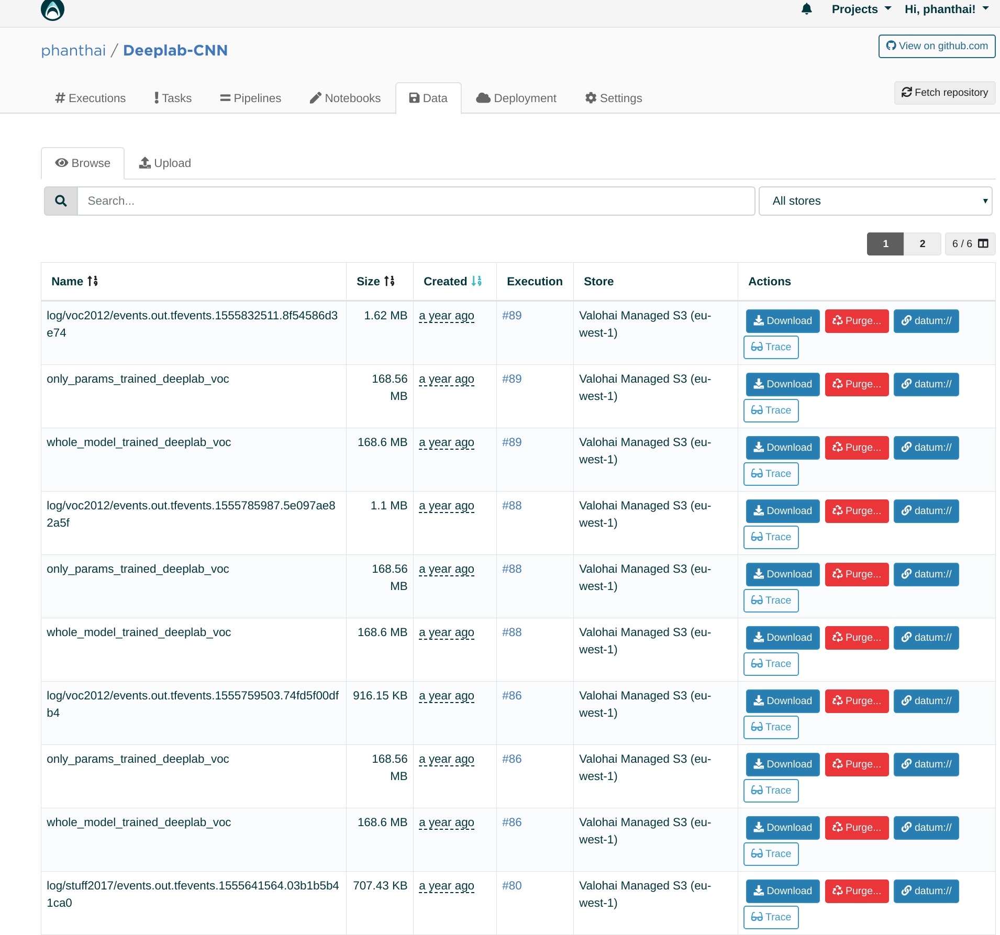
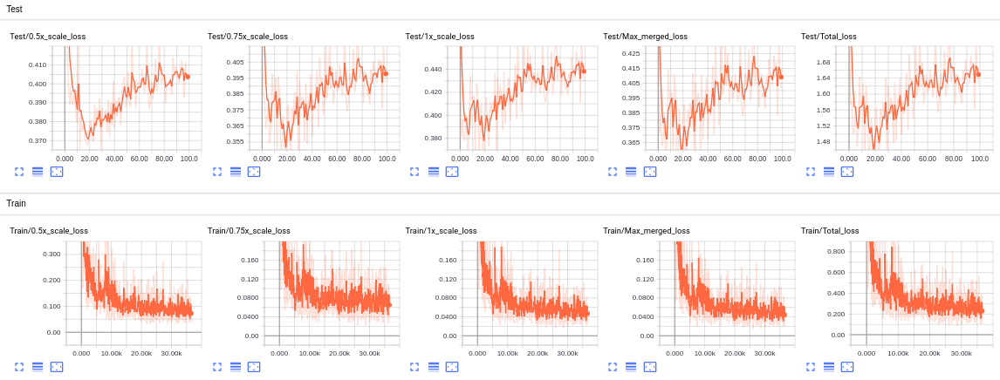
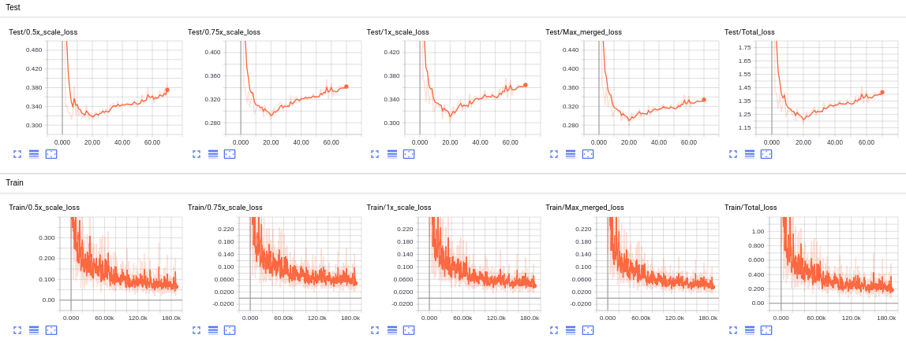

# [PYTORCH] Deeplab

## Introduction

Pytorch implementation of the model described in the paper **DeepLab: Semantic resultss Segmentation with Deep Convolutional Nets, Atrous Convolution, and Fully Connected CRFs** [paper](https://arxiv.org/abs/1606.00915). 

## Datasets:

I used 2 different datases: VOC2012 and VOCaugmented (VOC2007 + 2012) Statistics of datasets I used for experiments is shown below

| Dataset                | #Classes | #Train resultsss | #Validation resultsss |
|------------------------|:----------:|:---------------:|:--------------------:|
| VOC2012                |    20    |      5011     |        1449        |
| VOCaugmented           |    20    |      1464     |        1449        |

## Training

* Using Valohai platform
* Valohai platform overview

## Experiments:

I trained models in Valohai platform using CSC Cluster. The model version control show in the picture. For each run Valohai save the results, export log, metadata and model to CSC Cloud storage

- **VOC2012**

- **VOCaugmented**

## resultss

Some output predictions for experiments for each dataset are shown below:

- **VOC2012**

  
  
  

- **VOCaugmented**

  
  
  
